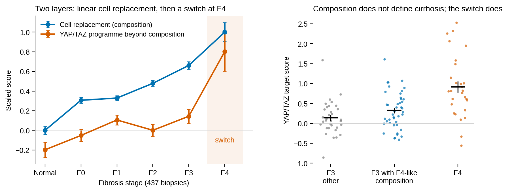
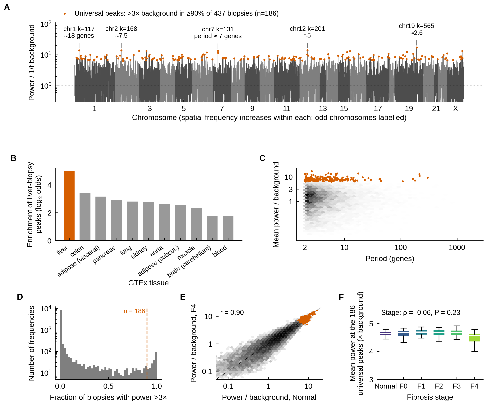
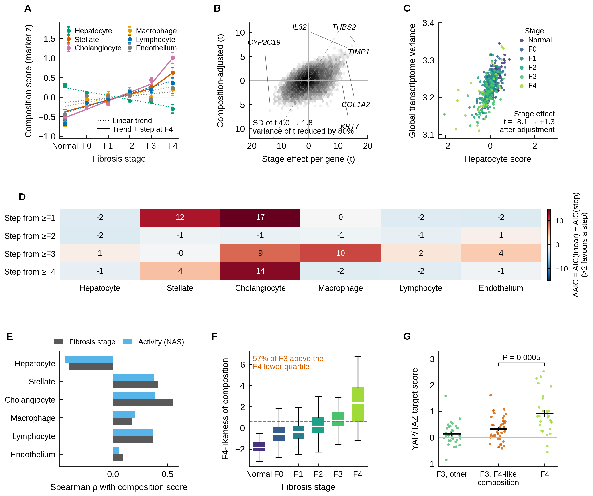
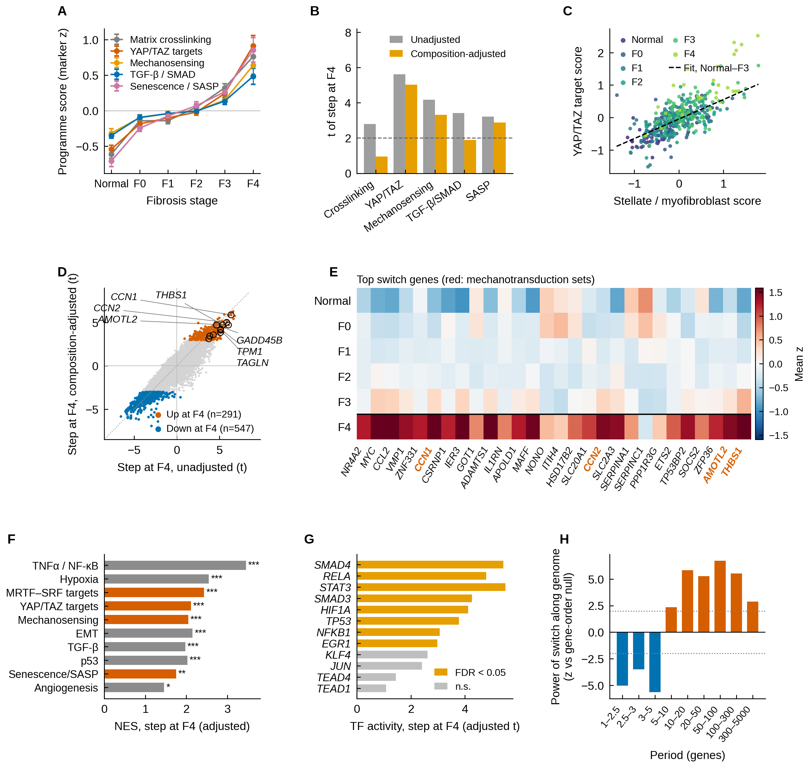
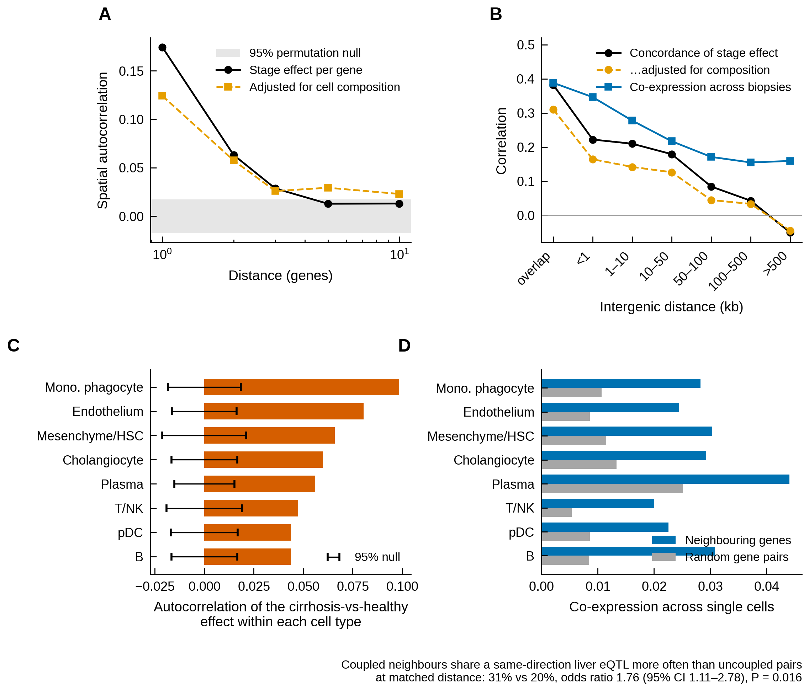
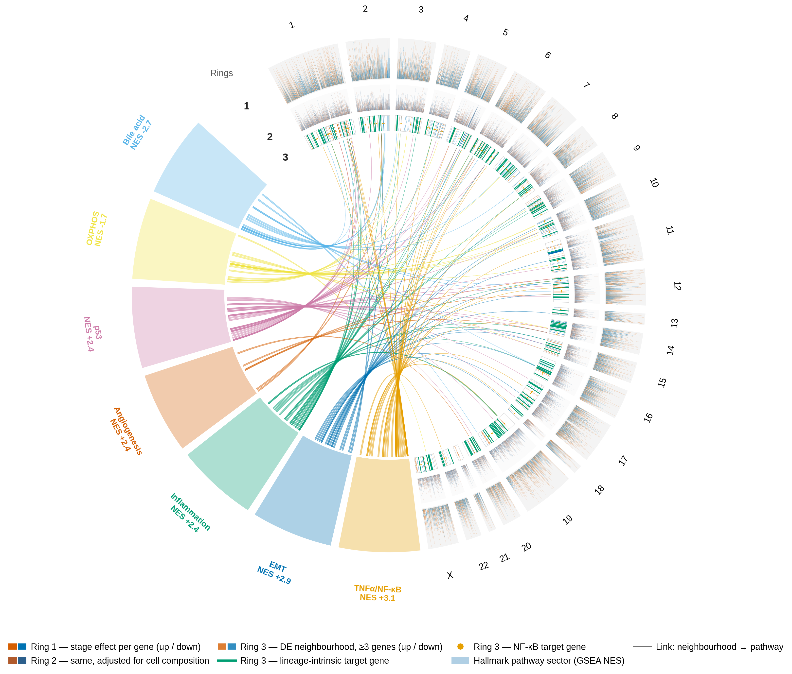
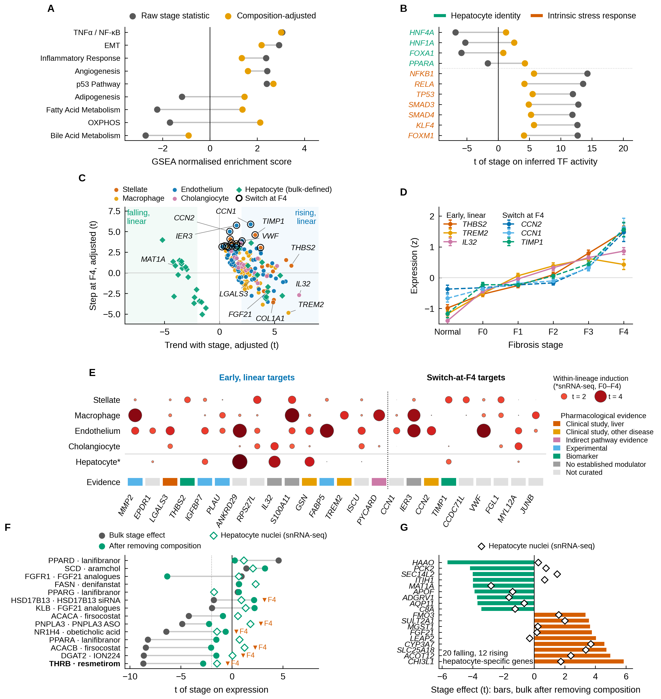

<<<<<<< HEAD
# Liver Spectra
### Cellular composition and mechanotransduction signatures across fibrosis stages in MASLD

[](https://www.python.org/)
[](#citation)
=======
# Liver_Spectra

### Cellular composition and mechanotransduction signatures across fibrosis stages in MASLD

[](https://www.python.org/)
[](https://github.com/Danpc11/Liver_Spectra/actions/workflows/audit.yml)
[](CHANGELOG.md)
[](#citation)
[](LICENSE)
>>>>>>> 3ed2618 (Clean re-run, review corrections, supplementary figures S1-S9)

---

## What this is

This repository reproduces every table and figure of a study that asks how the human liver transcriptome changes from
normal histology to cirrhosis (F4) in metabolic dysfunction-associated steatotic liver disease (MASLD), which part of
that change is cell replacement, which part is cell-intrinsic, and where mechanosensitive signalling enters.

The result the repository exists to support is that **fibrosis progression has two layers with different dynamics**:

| Layer | What it is | How it behaves |
| --- | --- | --- |
| **Compositional** | replacement of hepatocytes by hepatic stellate cells, immune cells and ductular epithelium | linear in stage; explains **80%** of stage-associated expression change |
| **Cell-intrinsic** | programmes that change within lineages, organised in cis-coupled gene neighbourhoods | includes a YAP/TAZ mechanotransduction programme that is flat through F3 and **switches on at F4**, independently of composition |

More than half of F3 biopsies already carry an F4-like cell composition without the mechanical programme: composition
does not define cirrhosis, the switch does.

<<<<<<< HEAD
=======


>>>>>>> 3ed2618 (Clean re-run, review corrections, supplementary figures S1-S9)
---

## Key findings

1. **A stage-invariant positional architecture.** Ordering genes by chromosomal position and computing positional
   spectra in 437 biopsies reveals 186 spatial frequencies present in ≥90% of biopsies, specific to liver among 11 GTEx
   tissues and unchanged from normal liver to F4 (Fig. 1).
2. **Linear cell replacement with thresholds.** Composition explains 80% of the per-gene stage effect; the ductular
   and stellate compartments rise stepwise at F3–F4 (Fig. 2).
3. **A mechanical switch at F4.** 291 genes rise and 547 fall abruptly at F4 after composition adjustment, led by
   YAP/TAZ targets (*CCN1*, *CCN2*, *AMOTL2*, *THBS1*), driven by SMAD, NF-κB, STAT3 and HIF1A activity and organised in
   genomic domains of 10–300 genes (Fig. 3).
4. **Cis-coupled neighbourhoods within every lineage.** Neighbouring genes change together (lag-1 autocorrelation
   0.17, z = 20), share liver eQTL variants (odds ratio 1.76), and stay coupled within each cell population in single-cell
   and single-nucleus RNA-seq, hepatocytes included (z = 17) (Figs. 4–5).
5. **Therapeutic timing.** Of 154 lineage-intrinsic targets, 86 rise early and linearly (*THBS2*, *TREM2*, *IL32*,
   *LGALS3*) and 17 belong to the F4 switch (*CCN2*/CTGF, *CCN1*, *TIMP1*, *VWF*); hepatocyte drug receptors are lost
   mainly with hepatocytes, with THR-β also falling per cell (Fig. 6).

<<<<<<< HEAD
=======
Every number above is re-checked against the regenerated tables by `scripts/audit_numbers.py` (see [Audit](#audit)).
>>>>>>> 3ed2618 (Clean re-run, review corrections, supplementary figures S1-S9)

---

## Included datasets

| Dataset | Content | Role here | Reference |
| --- | --- | --- | --- |
| [GSE130970](https://www.ncbi.nlm.nih.gov/geo/query/acc.cgi?acc=GSE130970) | bulk RNA-seq, 78 liver biopsies | discovery cohort | Hoang et al., *Sci Rep* 2019 · [10.1038/s41598-019-48746-5](https://doi.org/10.1038/s41598-019-48746-5) |
| [GSE135251](https://www.ncbi.nlm.nih.gov/geo/query/acc.cgi?acc=GSE135251) | bulk RNA-seq, 216 liver biopsies | discovery cohort | Govaere et al., *Sci Transl Med* 2020 · [10.1126/scitranslmed.aba4448](https://doi.org/10.1126/scitranslmed.aba4448) |
| [GSE162694](https://www.ncbi.nlm.nih.gov/geo/query/acc.cgi?acc=GSE162694) | bulk RNA-seq, 143 livers incl. normal histology | discovery cohort | Pantano et al., *Sci Rep* 2021 · [10.1038/s41598-021-96966-5](https://doi.org/10.1038/s41598-021-96966-5) |
| [GSE136103](https://www.ncbi.nlm.nih.gov/geo/query/acc.cgi?acc=GSE136103) | scRNA-seq, 5 healthy and 5 cirrhotic livers | within-lineage validation (non-parenchymal) | Ramachandran et al., *Nature* 2019 · [10.1038/s41586-019-1631-3](https://doi.org/10.1038/s41586-019-1631-3) |
| [GSE202379](https://www.ncbi.nlm.nih.gov/geo/query/acc.cgi?acc=GSE202379) | snRNA-seq, 59 samples from 47 SAF-staged donors | within-lineage validation incl. hepatocytes | Gribben et al., *Nature* 2024 · [10.1038/s41586-024-07465-2](https://doi.org/10.1038/s41586-024-07465-2) |
| [GTEx v8 / v10–11](https://gtexportal.org) | liver cis-eQTL; bulk expression of 11 tissues | shared eQTLs; tissue specificity | GTEx Consortium, *Science* 2020 · [10.1126/science.aaz1776](https://doi.org/10.1126/science.aaz1776) |
| [eQTL Catalogue QTD000266](https://www.ebi.ac.uk/eqtl/) | fine-mapped liver eQTL credible sets | shared eQTLs (fine-mapped) | Kerimov et al., *PLoS Genet* 2023 · [10.1371/journal.pgen.1010932](https://doi.org/10.1371/journal.pgen.1010932) |
| [GWAS Catalog](https://www.ebi.ac.uk/gwas/) | genome-wide significant associations | MASLD and cirrhosis loci, non-liver controls | Sollis et al., *Nucleic Acids Res* 2023 · [10.1093/nar/gkac1010](https://doi.org/10.1093/nar/gkac1010) |
| [Liver TADs](https://github.com/emcarthur/TAD-stability-heritability) | liver topologically associating domains (hg19) | TAD test | McArthur & Capra, *Am J Hum Genet* 2021 · [10.1016/j.ajhg.2020.12.008](https://doi.org/10.1016/j.ajhg.2020.12.008) |
| [DoRothEA](https://github.com/saezlab/dorothea) · [MSigDB Hallmark](https://www.gsea-msigdb.org) | TF regulons; Hallmark gene sets | TF activity; GSEA | Garcia-Alonso et al., *Genome Res* 2019 · Liberzon et al., *Cell Syst* 2015 |
<<<<<<< HEAD

=======
| this study | mouse liver RNA-seq (control vs UTP, n = 3 + 3) | cross-species replication | GEO accession pending |
>>>>>>> 3ed2618 (Clean re-run, review corrections, supplementary figures S1-S9)

The three bulk cohorts are shipped in `data/raw/` as raw counts; all other resources are downloaded (see
[Reproduce the analysis](#reproduce-the-analysis)), because of their size and their own licences.

---

## Figures

| | | |
| --- | --- | --- |
| [](results/figures/jhep/Fig1_design_and_positional_framework.pdf) **Fig. 1** Positional framework | [](results/figures/jhep/Fig2_linear_replacement_thresholds.pdf) **Fig. 2** Linear replacement and thresholds | [](results/figures/jhep/Fig3_mechanical_switch.pdf) **Fig. 3** The mechanical switch |
| [](results/figures/jhep/Fig4_neighbourhood_coupling.pdf) **Fig. 4** Cis-coupled neighbourhoods | [](results/figures/jhep/Fig5_genome_circos.pdf) **Fig. 5** Genome-wide map | [](results/figures/jhep/Fig6_two_layers_and_targets.pdf) **Fig. 6** Two layers and targets |

<<<<<<< HEAD
Vector PDFs and 300-dpi TIFFs are in `results/figures/jhep/`; Supplementary Figures S1–S9 are in `results/figures/jhep/supplementary/`.
=======
Vector PDFs and 300-dpi TIFFs are in `results/figures/jhep/`; Supplementary Figures S1–S9 are in `results/figures/jhep/supplementary/`.
>>>>>>> 3ed2618 (Clean re-run, review corrections, supplementary figures S1-S9)
A second figure set formatted for *Genome Research* is in `results/figures/genome_research/`.

---

## Repository structure

```
scripts/
    common.py                    paths, constants, marker sets, shared statistics
    00_fetch_external.sh         download the public resources
    01–08                        expression, positional spectra, DE, composition, single cell, GSEA/TF, targets
    11–15b                       mouse, eQTL, GTEx tissues, GWAS loci, the F4 mechanical switch
    18_snrnaseq_gse202379.py     single-nucleus validation (47 donors)
<<<<<<< HEAD
    09, 10, 16, 17               figures (Genome Research set; JHEP main set; JHEP supplementary S1–S9)
=======
    09, 10, 16, 17               figures (Genome Research set; JHEP main set; JHEP supplementary S1–S9)
>>>>>>> 3ed2618 (Clean re-run, review corrections, supplementary figures S1-S9)
    audit_numbers.py             re-checks every number quoted in the manuscripts
    99_readme_overview.py        the overview image above
data/raw/                        bulk counts, GEO metadata, gene-order grid, mouse counts (shipped)
data/external/                   downloaded resources (see data/external/README.md)
data/curated/drug_landscape.csv  curated pharmacology of candidate targets
results/tables/                  Supplementary Tables S1–S18 (CSV)
results/figures/                 jhep/ and genome_research/ figure sets
assets/                          README images
AUDIT.md · CHANGELOG.md · CITATION.cff · .zenodo.json · LICENSE
```

---

## Reproduce the analysis

```bash
git clone https://github.com/Danpc11/Liver_Spectra.git && cd Liver_Spectra
python -m venv .venv && source .venv/bin/activate
pip install -r requirements.txt

make external     # DoRothEA, Hallmark GMT, liver TADs; then add the files listed in data/external/README.md
make all          # full pipeline, raw counts to every table and figure (~45 min, one core, < 3 GB RAM)
make audit        # re-check the numbers quoted in the manuscripts
```

To check the released results without re-running anything, `make audit` alone reads the shipped tables in
`results/tables/` and needs only numpy and pandas; this is what the Audit badge runs on every push.

| Target | Runs |
| --- | --- |
| `make external` | downloads the public resources |
| `make analysis` | steps 01–08, 11–15b and 18 (tables only) |
| `make figures` | steps 09, 10 and 16 (needs `results/intermediate/` from a previous run) |
| `make all` | everything, in order |
| `make audit` | the number checks |
| `make clean` | deletes generated results |

---

## Audit

<<<<<<< HEAD
`scripts/audit_numbers.py` recomputes 81 numbers quoted in the manuscripts from the regenerated tables and fails if any
=======
`scripts/audit_numbers.py` recomputes 81 numbers quoted in the manuscripts from the regenerated tables and fails if any
>>>>>>> 3ed2618 (Clean re-run, review corrections, supplementary figures S1-S9)
differs (all pass in v1.0.0). `AUDIT.md` reports the clean re-run, the component-by-component methodological review,
the corrections made during review, and the open items.

---

## Limitations

- **Cross-sectional data.** Irreversibility at F3–F4 is inferred from the threshold form and the cell-independence of
  the response, not observed longitudinally; liver stiffness was not measured in these cohorts.
- **Marker-based composition.** Composition scores come from marker sets on the same matrix that is then adjusted, so
  the 80% figure is an upper bound and the adjusted effect is conservative for marker genes.
- **Few F4 biopsies in snRNA-seq.** GSE202379 has four biopsy-staged F4 donors; F4 estimates there lean on five
  end-stage explants, reported separately from biopsy-only estimates.
- **Hepatocytes in scRNA-seq.** Dissociation-based scRNA-seq captures few hepatocytes; hepatocyte conclusions rest on
  bulk data validated in snRNA-seq.
- **Gene mapping of GWAS loci** assigns bystander genes, which dilutes the enrichment; the GWAS analysis is supplementary.
- **The mechanical interpretation awaits a direct test** (hepatocytes and stellate cells on soft and stiff hydrogels,
  with and without YAP–TEAD inhibition).

The candidate targets are a ranking for follow-up, not a validated discovery set with error control.

---

## Publication

<<<<<<< HEAD
**Liver fibrosis in MASLD progresses by linear cell replacement until a mechanically driven switch at the F3–F4
transition.** Manuscript submitted to the *Journal of Hepatology*. Until it is published, please cite the archived
=======
**Cellular composition and mechanotransduction signatures across fibrosis stages in MASLD.** Manuscript submitted to the *Journal of Hepatology*. Until it is published, please cite the archived
>>>>>>> 3ed2618 (Clean re-run, review corrections, supplementary figures S1-S9)
software release below.

---

## Citation

The software will be archived on Zenodo at the v1.0.0 release (DOI to be added). A machine-readable citation is in
[`CITATION.cff`](CITATION.cff), which GitHub exposes through *Cite this repository*.

---

## Licence

Source code is distributed under the [MIT licence](LICENSE). The third-party datasets analysed here (GEO, GTEx, eQTL
Catalogue, GWAS Catalog, liver TAD partitions) remain under their own terms; values derived from them in
`results/tables/` should be cited together with the original sources listed in [Included datasets](#included-datasets).

---

## Technical reference

### Pipeline

| Step | Script | What it does | Main outputs |
| --- | --- | --- | --- |
| 00 | `00_fetch_external.sh` | downloads DoRothEA (saezlab), Hallmark v7.0 GMT (public mirror), liver TAD partitions (McArthur & Capra); extracts GSE136103 | `data/external/*` |
| 01 | `01_prepare_expression.py` | parses GEO characteristics, defines conditions (Normal/Control/F0–F4), median-of-ratios + log2, cohort correction protecting condition | S1, `expr*.pkl`, `meta.pkl` |
| 02 | `02_spectra.py` | per-sample positional spectra (log, within-cohort z, multitaper), 1/f whitening, permutation null, grid-mask control, universal peaks, condition spectra, stage effects per frequency and band | S2a–e, `W_adj.pkl`, `W_mt.pkl` |
| 03 | `03_specparam.py` | aperiodic offset/exponent and periodic peak count per sample × chromosome; stage models | S3a–d |
| 04 | `04_differential_expression.py` | pyDESeq2 ordinal-stage and F4-vs-Normal; programme enrichment; spatial autocorrelation of the DE statistic; adjacent concordant pairs; contiguous neighbourhoods | S4a–c, S5a–c, `de.pkl` |
| 05 | `05_composition_distance_tads.py` | marker-based composition; composition-adjusted stage effects and ACF; GRCh37 coordinates, orientation, co-expression; liver TAD reconstruction and distance-stratified TAD test; threshold-vs-linear (AIC) and bimodality | S5d–i, S6a–c, S7a–b, `pairs.pkl`, `K_tad.pkl` |
| 06 | `06_single_cell.py` | GSE136103 QC, marker annotation, pseudobulk, within-type cirrhosis-vs-healthy t, within-type ACF and neighbour co-expression | S8a–d |
| 07 | `07_gsea_tf.py` | GSEA pre-ranked (Hallmark) on ordinal and composition-adjusted statistics; DoRothEA A–C TF activity vs stage; shared TFs in coupled pairs; TF × Hallmark overlap | S10a–h |
| 08 | `08_targets_fingerprint.py` | lineage-intrinsic target prioritisation (bulk × composition × single cell, + curated drug landscape); spectral fingerprint with real vs shuffled gene order (leave-one-cohort-out) | S9a–b, S11 |
| 09 | `09_make_figures.py` | Genome Research figure set, Figs 1–5 | `results/figures/genome_research/` |
| 10 | `10_make_circos.py` | Genome Research Figs 6–7 (circos genome map; TF × Hallmark chord) | `results/figures/genome_research/`, S5j |
| 11 | `11_mouse_validation.py` | own mouse fatty-liver data (CTL vs UTP, n = 3 + 3): DESeq2, invariant spectrum, spatial coupling, distance decay, syntenic human pairs | S12a–e, Extended Data Fig. 1 |
| 12 | `12_eqtl_shared_variants.py` | liver eQTL credible sets (eQTL Catalogue QTD000266): shared causal variants in coupled vs uncoupled neighbours | S13a–c |
| 13 | `13_gtex_tissues.py` | spectra in 11 GTEx tissues; tissue specificity of the architecture; replication of biopsy peaks | S14a–f, Extended Data Fig. 2 |
| 14 | `14_eqtl_gtex_signif_pairs.py` | GTEx v8 liver significant eQTL pairs: shared (same-direction) variants in coupled vs uncoupled neighbours, MH stratified by distance | S13d–g |
| 15 | `15_gwas_loci_neighbourhoods.py` | MASLD/cirrhosis GWAS loci (curated + GWAS Catalog with non-liver controls) in coupled neighbourhoods | S16, S16b–d |
| 15b | `15b_mechanical_switch.py` | mechanotransduction programme scores and thresholds (S15), F4-likeness of composition (S7c), the F3→F4 switch gene by gene, and the timing of lineage-intrinsic targets (S17h): composition-adjusted step at F4, DESeq2 F4 vs F3, GSEA with mechanotransduction sets, TF drivers, positional scale, cell of origin | S15, S7c, S17a–g |
| 18 | `18_snrnaseq_gse202379.py` | validation in snRNA-seq of 47 donors (GSE202379): annotation, donor pseudobulk, concordance with bulk, hepatocyte class, neighbour coupling, neighbour co-expression across nuclei and the F4 switch within populations; Figs 4D,E and 6E–G, Supplementary Fig. S8 | S18a–h |
| 16 | `16_figures_jhep.py` | Journal of Hepatology figure set (Figs 1–6, Supplementary GWAS figure) and Table 1 | `results/figures/jhep/` |

### Data manifest

#### A. Inputs to upload (not generated; `data/raw/`)

| File | Content | Size | Source |
| --- | --- | --- | --- |
| `counts/counts_GSE130970.tsv` | raw gene counts, 26,808 Ensembl genes × 78 samples | 12 MB | GEO GSE130970 (Hoang 2019) |
| `counts/counts_GSE135251.tsv` | raw gene counts × 216 samples | 15 MB | GEO GSE135251 (Govaere 2020) |
| `counts/counts_GSE162694.tsv` | raw gene counts × 143 samples | 10 MB | GEO GSE162694 (Pantano 2021) |
| `metadata/metadata_GSE*.tsv` (3) | GEO sample characteristics (fibrosis stage, NAS, sex, age) | <100 kB | GEO series matrices |
| `own/mcounts.tsv` | own mouse liver RNA-seq counts (CTL1–3, UTP1–3; ARC-UTP columns present but not used) | 3 MB | this study (to be deposited in GEO) |
| `grid/<GSE>_gene_grid.tsv` (5) | positional grid: chr, grid_index, gene_id, gene_name (same gene → same index in every file; union is used) | 2–3 MB | this project |

#### B. Public external resources (fetched by `00_fetch_external.sh`; `data/external/`)

| File | Content | Source |
| --- | --- | --- |
| `dorothea_hs.rda` | DoRothEA human regulons (tf, confidence, target, mor) | github.com/saezlab/dorothea |
| `hallmark.gmt` | MSigDB Hallmark v7.0 symbols | public mirror (replace with official MSigDB download) |
| `TAD-stability-heritability-master/data/20binsTADlandscape/Liver_leung2015/` | liver TAD partitions (hg19), 20 bins per domain | github.com/emcarthur/TAD-stability-heritability |
| `GSE136103/*_{matrix.mtx,genes.tsv,barcodes.tsv}.gz` | Ramachandran 2019 human liver scRNA-seq (20 liver samples used) | GEO GSE136103 (`GSE136103_RAW.tar`, 436 MB, manual download) |
| `GSE202379/GSM*_raw_counts_csv.gz` (59) + series matrix | snRNA-seq of 47 MASLD donors, SAF-staged (Gribben et al., Nature 2024) | GEO GSE202379 |
| `QTD000266.credible_sets.tsv.gz` | GTEx liver eQTL fine-mapped credible sets | eQTL Catalogue FTP `susie/QTS000015/QTD000266/` |
| `gwas-catalog-download-associations-v1.0-full.tsv` | GWAS Catalog full associations (P < 5e-8 filtered in script 15) | GWAS Catalog downloads |
| `Liver.v8.signif_variant_gene_pairs.txt.gz`, `Liver.v8.egenes.txt.gz` | GTEx v8 liver single-tissue cis-eQTL (significant pairs, eGenes) | GTEx Portal, QTL downloads (GTEx_Analysis_v8_eQTL.tar) |
| `gtex/gene_reads_*_<tissue>.gct.gz` (11) | GTEx gene read counts per tissue (v11; whole blood v10) | GTEx Portal, bulk tissue expression |
| GRCh37 Ensembl 100 gene table | coordinates and strand | bundled in the `pyannotables` package |

#### C. Generated tables (`results/tables/`; Supplementary Tables of the manuscript)

| Table | File | Content | Script |
| --- | --- | --- | --- |
| S1 | `Table_S1_samples.csv` | 437 samples: cohort, condition, ordinal stage, sex, age, NAS | 01 |
| S2a | `Table_S2a_consensus_spectrum_universal_peaks.csv` | 10,007 frequencies: period, mean power/null, fraction of samples >3× (overall and per cohort), grid-mask power, universal flag | 02 |
| S2b | `Table_S2b_condition_spectra_{log,z,multitaper}.csv` | consensus spectrum per condition (mean log w, s.e., t vs null, q) | 02 |
| S2c | `Table_S2c_stage_effect_per_frequency_{…}.csv` | ordinal-stage t, p, q per frequency | 02 |
| S2d | `Table_S2d_stage_effect_per_band_{…}.csv` | stage t per period band | 02 |
| S2e | `Table_S2e_band_profile_by_condition_{…}.csv` | mean log w per band and condition | 02 |
| S3a–b | `Table_S3a_specparam_per_sample_chromosome.csv`, `Table_S3b_specparam_peaks_per_sample.csv` | aperiodic offset/exponent, residual s.d., peak count; individual peaks | 03 |
| S3c–d | `Table_S3c_specparam_vs_stage.csv`, `Table_S3d_exponent_per_chromosome_vs_stage.csv` | stage models of the parameters; per-chromosome exponent | 03 |
| S4a–b | `Table_S4a_DESeq2_F4_vs_Normal.csv`, `Table_S4b_DESeq2_ordinal_stage.csv` | DESeq2 results | 04 |
| S4c | `Table_S4c_programme_enrichment_DE.csv` | Fisher enrichment of curated programmes | 04 |
| S5a–c | `Table_S5a_spatial_autocorrelation_DE.csv`, `Table_S5b_adjacent_DE_pairs.csv`, `Table_S5c_contiguous_DE_neighbourhoods.csv` | ACF with permutation null; adjacent pairs vs null; 422 runs ≥3 genes | 04 |
| S5d | `Table_S5d_acf_with_without_composition.csv` | ACF of per-gene stage effect, raw and composition-adjusted | 05 |
| S5e | `Table_S5e_liver_TADs_reconstructed_hg19.csv` | 1,304 reconstructed liver TADs | 05 |
| S5f–h | `Table_S5f_adjacent_pairs_distance_orientation_TAD.csv`, `Table_S5g_concordance_by_distance.csv`, `Table_S5h_concordance_by_orientation.csv` | all adjacent pairs with distance, orientation, family, TAD, statistics, co-expression; summaries | 05 |
| S5i | `Table_S5i_TAD_test_stratified.csv` | same- vs different-TAD difference at equal distance (permutation) | 05 |
| S5j | `Table_S5j_neighbourhood_pathway_links.csv` | neighbourhood → Hallmark leading-edge links (Fig. 6) | 10 |
| S6a–c | `Table_S6a_marker_counts.csv`, `Table_S6b_composition_scores_per_sample.csv`, `Table_S6c_stage_effect_per_gene_with_without_composition.csv` | composition scores and per-gene stage t with/without adjustment | 05 |
| S7a–b | `Table_S7a_threshold_vs_linear.csv`, `Table_S7b_within_stage_bimodality.csv` | ΔAIC of step models; GMM bimodality | 05 |
| S8a–d | `Table_S8a_single_cell_annotation.csv`, `Table_S8b_within_type_neighbour_coexpression.csv`, `Table_S8c_within_type_spatial_autocorrelation.csv`, `Table_S8d_within_type_t_cirrhosis_vs_healthy.csv` | single-cell annotation, co-expression, ACF, per-type t | 06 |
| S9a–b | `Table_S9a_candidate_targets_lineage_intrinsic.csv`, `Table_S9b_integration_bulk_sc_per_gene.csv` | prioritised targets with drug landscape; full integration table | 08 |
| S10a–h | `Table_S10a_GSEA_hallmark_ordinal.csv`, `Table_S10b_GSEA_hallmark_composition_adjusted.csv`, `Table_S10c_dorothea_ABC_regulons_used.csv`, `Table_S10d_DoRothEA_TF_activity_vs_stage.csv`, `Table_S10e_TF_activity_per_sample.csv`, `Table_S10f_shared_TF_coupled_pairs.csv`, `Table_S10g_shared_TFs_by_direction.csv`, `Table_S10h_TF_x_Hallmark_overlap.csv` | GSEA, TF activity, shared regulators, TF × pathway matrix | 07 |
| S17a–g | `Table_S17a_F4_switch_per_gene.csv` … `Table_S17g_F4_switch_genes_cell_of_origin.csv` | F4 mechanical switch: per-gene step, GSEA, TF drivers, spatial autocorrelation, power by band, neighbourhood enrichment, cell of origin | 15b |
| S11 | `Table_S11_spectral_fingerprint_real_vs_shuffled.csv` | leave-one-cohort-out classification, real vs shuffled gene order | 08 |
| S12a–e | `Table_S12a_mouse_DESeq2_UTP_vs_CTL.csv`, `Table_S12b_mouse_spectrum_universal_peaks.csv`, `Table_S12c_mouse_spatial_autocorrelation.csv`, `Table_S12d_mouse_concordance_by_distance.csv`, `Table_S12e_mouse_syntenic_pairs.csv` | mouse validation: DE, spectrum, ACF, distance decay, syntenic pairs | 11 |

#### D. Generated figures (`results/figures/`, PDF vector + PNG 400 dpi)

Fig1 invariant architecture · Fig2 stage effects on the spectrum · Fig3 spatial coupling and TADs ·
Fig4 composition and thresholds · Fig5 single-cell coupling and targets · Fig6 genome circos · Fig7 TF × Hallmark chord ·
Extended Data Fig1 mouse validation.

### Column glossary (Spanish labels kept for provenance)

The pipeline was developed in Spanish and some column values in the generated tables retain Spanish
labels. They are stable identifiers, not free text:

| In the tables | Meaning |
| --- | --- |
| `estadio` | condition / fibrosis stage (`Normal`, `Control`, `F0`–`F4`) |
| `orden` | ordinal stage, 0 (Normal/Control) to 5 (F4) |
| `cohorte`, `muestra`, `sexo`, `edad` | cohort, sample, sex, age |
| `Hepatocito`, `HSC`, `Colangiocito`, `Macrofago`, `Linfocito`, `Endotelio` | hepatocyte, stellate/myofibroblast, cholangiocyte, macrophage, lymphocyte, endothelium |
| `Mesenquima_HSC`, `Fagocito_mononuclear` | single-cell populations: mesenchyme/stellate, mononuclear phagocyte |
| `banda`, `periodo` | period band, period in genes |

The positional grid is the union of five per-cohort grid files; two of them (GSE142530, GSE276114)
come from cohorts that are not otherwise analysed but contribute gene slots, so all five files are
required to reproduce the published grid.

### Notes on reproducibility

* Key numbers checked against the manuscript on a clean run: 13,816 genes; 186 universal peaks; stage-associated
  frequencies 6,042 (log) / 0 (z) / 6,345 (multitaper); DE padj<0.05 8,713 (F4 vs Normal) / 7,520 (ordinal);
  adjacent concordant pairs 954/957 vs 692/654; 422 neighbourhoods; composition explains 79.8% of stage-effect
  variance; offset stage t −8.1 → +1.3 after composition; 154/70 TFs before/after composition; fingerprint AUC 0.92
  (real) vs 0.91 (shuffled).
* `pyannotables` ships Ensembl 100 GRCh37; TADs are hg19 — both coordinate systems are GRCh37-consistent.
* The Hallmark GMT is v7.0 from a public mirror; for submission re-run step 07 with the official MSigDB release
  and, optionally, CollecTRI in place of DoRothEA (same column layout: tf, target, mor).
* Single-cell annotation is marker-based (no clustering) and leaves ~50% of cells unassigned by design; see
  Methods.
